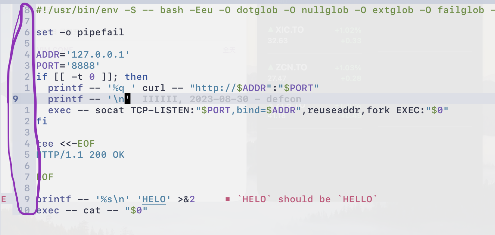
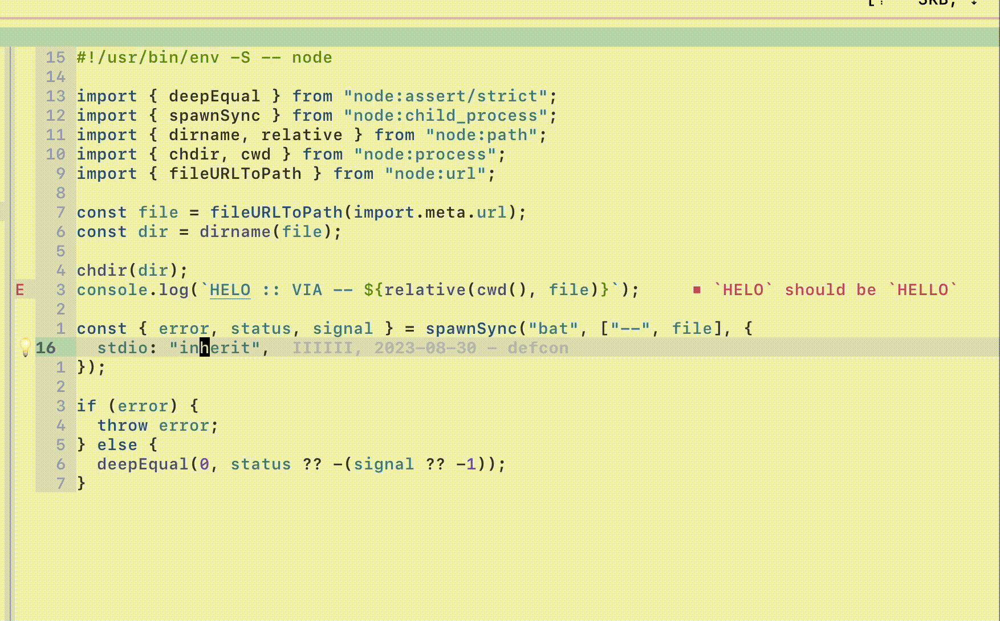

# `whoami`

- [https://github.com/ms-jpq](https://github.com/ms-jpq)

- Wang, Hao

- Life status: NEET, traveling the ~~flat~~ Earth

- If you are in Seattle area: Wink, Wink

- [hao@bigly.dog](mailto:hao@bigly.dog)

---

# `$USER@$HOSTNAME`


## Vim Related

- [chadtree](https://github.com/ms-jpq/chadtree), NerdTree but chad

- [coq.nvim](https://github.com/ms-jpq/coq_nvim), CoC.nvim but coq

- [lua async await](https://github.com/ms-jpq/lua-async-await), coroutine based control flow for libuv

## Misc

- [sad](https://github.com/ms-jpq/sad), interactive TUI sed(ish)

- [noact](https://github.com/ms-jpq/noact), React virtual DOM in 70 lines (fully typed)

- lots more...

---

# Cultural Learnings of VIM for Make Benefit Glorious Nation of UNIX

- Translation: Understanding `UNIX` through the lens of `VIM`

- `VIM` ⇆ `[Everything is a File, Files are Text, Processes communicate via Flies]` ⇆ `UNIX`

- `VIM` ⇆ **Recursion** ⇆ `UNIX`

---

# What makes VIM special?

- `HJKL` 👏

- `←↑↓→` ✋

- "Weird" things like relative positioning?



---

# [The Gainz](https://www.youtube.com/watch?v=qjlpBiQjzPg)

- Prepped chicken, steamed rice, raw eggs, frozen lettuce

- **Blend `.into()` smoothie**

- Breakfast, lunch, dinner


---

# Vim is more of a ~syntax~ editor

## TreeSitter 🌳🪑

- Syntax ↔ Semantics

- Select part of syntax you want to alter → Change / Delete



---

# Whataboutism

## These all have TreeSitter 🌳🪑

- Whatabout `emacs`

- Whatabout `helix`

- Whatabout `zed`

- ~~Whatabout `atom`~~

- **Whatabout `vscode`**

---

# What about "ad hoc" syntax

## `ini` style: systemd, samba, mypy, php, git, warcraft3, fallout, literally everything

```toml
[Match]
Name              = vtor
Driver            = dummy

[Link]
RequiredForOnline = no

[Network]
DHCP              = no
IPv6AcceptRA      = no

Domains           = ~onion ~exit
```

---

## `Nginx` style: lighttpd, haproxy, dhclient, etc

```nginx
server {
  server_name "";
  include     /usr/local/opt/nginx/conf/listen.nginx;

  location / {
    alias           /usr/local/opt/nginx/index/;
    sub_filter_once off;
    sub_filter      "@SCHEME" $scheme;
    sub_filter      "@HOST" $optimistic_host;
  }
}
```

---

## `XML`ish style: openvpn, cups, apache, etc

```xml
Listen 80
<VirtualHost *:80>
  DocumentRoot "/www/example1"
  ServerName www.example.com
</VirtualHost>

<VirtualHost *:80>
  DocumentRoot "/www/example2"
  ServerName www.example.org
  # Other directives here
</VirtualHost>
```

---

# Incantations for the machine spirits


- `"…"` ⇒ `CI"`

- `'…'` ⇒ `CI'`

- `<…>` ⇒ `CI>`

- `(…)` ⇒ `CI)`

- `{…}` ⇒ `CI}`

- _Consecutive "word" characters_ `/[A-z_]+/` ⇒ `CIw`

- _**Not** whitespace characters_ `[^s]+` ⇒ `CIW`

---

# Core tenants of the `UNIX` machine spirits

- Files

- Text

- Processes

- **Recursion**


---

# Recursive Bash HTTP Server

- A TCP socket is a file

- HTTP is a text protocol

- `bash` → `socat` → `bash` recursion

```bash
#!/usr/bin/env -S -- bash -Eeu -O dotglob -O nullglob -O extglob -O failglob -O globstar

set -o pipefail

ADDR='127.0.0.1'
PORT='8888'
if [[ -t 0 ]]; then
  printf -- '%q ' curl -- "http://$ADDR":"$PORT"
  printf -- '\n'
  exec -- socat TCP-LISTEN:"$PORT,bind=$ADDR",reuseaddr,fork EXEC:"$0"
fi

tee <<-EOF
HTTP/1.1 200 OK

EOF

SAYING="$(fortune | cowsay)"

printf -- '%s' "$SAYING"
gay <<<"$SAYING" >&2
```

## Other shell recursions

- `chroot`: before / after file system isolation

- `ip netns exec`: before / after network isolation

- **`ssh`**

```
bash -> ssh -> sshd -> bash
```

---

# `NVIM` Tree ~~Sitter~~

- Multi-Process

```bash
pstree
```

```txt
\-+= 08871 iiiiii nvim
  \-+= 08872 iiiiii nvim --embed
    |--= 08873 iiiiii /Library/Developer/CommandLineTools/Library/Frameworks/Python3.fr
    |--= 08874 iiiiii /Users/iiiiii/.config/nvim/pack/modules/start/chadtree/.vars/runt
    |-+= 08875 iiiiii /Users/iiiiii/.config/nvim/pack/modules/start/coq_nvim/.vars/runt
    | \-+- 09191 iiiiii /Users/iiiiii/Library/Preferences/nvim/pack/modules/start/coq_n
    |   |-+- 09198 iiiiii /Users/iiiiii/Library/Preferences/nvim/pack/modules/start/coq
    |   | \--- 09233 iiiiii /Users/iiiiii/Library/Preferences/nvim/pack/modules/start/c
    |   \--- 86848 iiiiii /Users/iiiiii/Library/Preferences/nvim/pack/modules/start/coq
    |--= 08882 iiiiii /Users/iiiiii/Library/Preferences/nvim/var/bin/typos-lsp
    |-+= 08901 iiiiii /Users/iiiiii/.local/share/.codeium/bin/3dee3c5d9fe70aff1993c1a94
    | \--- 08924 iiiiii /Users/iiiiii/.local/share/.codeium/bin/3dee3c5d9fe70aff1993c1a
    |--= 09011 iiiiii /Users/iiiiii/.local/asdf/installs/nodejs/20.8.0/bin/node /Users/
    |--= 09151 iiiiii /Users/iiiiii/Library/Preferences/nvim/var/bin/marksman server
    \--= 09152 iiiiii /Users/iiiiii/Library/Preferences/nvim/var/lib/ltex-ls/jdk-11.0.1
```

- `--embed` ??

- Plugins

- LSP servers

---

# `VIM` Classic

- `'shell' 'sh'		string	(default $SHELL or "sh", Win32: "cmd.exe")`

- `:help grep`

- `:help ctags`

- `:help make`

- `:help unnamed`

- `:help terminal`

## Installing `NVIM` on Windows comes with full `UNIX` suite via `msys2`

---

## `:help runtimepath`

```txt
$XDG_CONFIG_HOME/nvim,
$XDG_CONFIG_DIRS[1]/nvim,
$XDG_CONFIG_DIRS[2]/nvim,
…
$XDG_DATA_HOME/nvim[-data]/site,
$XDG_DATA_DIRS[1]/nvim/site,
$XDG_DATA_DIRS[2]/nvim/site,
…
$VIMRUNTIME,
…
$XDG_DATA_DIRS[2]/nvim/site/after,
$XDG_DATA_DIRS[1]/nvim/site/after,
$XDG_DATA_HOME/nvim[-data]/site/after,
…
$XDG_CONFIG_DIRS[2]/nvim/after,
$XDG_CONFIG_DIRS[1]/nvim/after,
$XDG_CONFIG_HOME/nvim/after"
```

## `man -- systemd.unit`

```txt
/etc/systemd/system.control/*
/run/systemd/system.control/*
/run/systemd/transient/*
/run/systemd/generator.early/*
/etc/systemd/system/*
/etc/systemd/system.attached/*
/run/systemd/system/*
/run/systemd/system.attached/*
/run/systemd/generator/*
…
/usr/lib/systemd/system/*
/run/systemd/generator.late/*
```

```txt
-+= 00001 root /sbin/launchd
 |--= 00490 root /usr/libexec/logd
 |--= 00491 root /usr/libexec/smd
 |--= 00492 root /usr/libexec/UserEventAgent (System)
 |--= 00494 root /System/Library/PrivateFrameworks/Uninstall.framework/Resources/uninst
 |--= 00495 root /System/Library/Frameworks/CoreServices.framework/Versions/A/Framework
 |--= 00496 root /System/Library/PrivateFrameworks/MediaRemote.framework/Support/mediar
 |-+= 00499 root /usr/sbin/systemstats --daemon
 | \--- 00769 root /usr/sbin/systemstats --logger-helper /private/var/db/systemstats
```

```txt
systemd
  ├─5/flow_checks --daemon --http-prefix=/ntop --disable-login=1
  ├─agetty -o -p -- \\u --noclear tty1 linux
  ├─chronyd
  ├─cron -f -P
  ├─dbus-daemon --system --address=systemd: --nofork --nopidfile --systemd-activation -
  ├─dnsmasq --conf-file=/run/local/dnsmasq/wg0/dnsmasq.conf
  ├─dnsmasq --conf-file=/run/local/dnsmasq/enp1s0/dnsmasq.conf
  ├─haproxy -Ws -f /etc/haproxy/haproxy.cfg -p /run/haproxy.pid -f /usr/local/opt/hapro
  │   └─haproxy -Ws -f /etc/haproxy/haproxy.cfg -p /run/haproxy.pid -f /usr/local/opt/h

```
